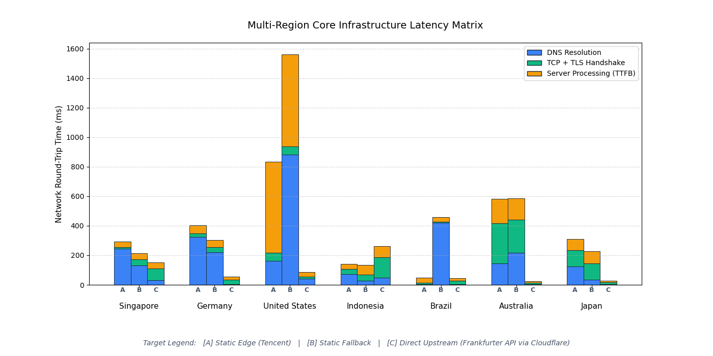

<p align="center">
  
</p>

<p align="center">
  <a href="https://github.com/rafifmsn/exchange/actions/workflows/ci.yml">
    
  </a>
  <a href="https://github.com/rafifmsn/exchange/blob/main/LICENSE">
    
  </a>
  <a href="http://tencentcloud.com">
    
  </a>
</p>

<p align="center">An ultra-low latency currency converter and real-time exchange rates dashboard. This project is opinionated and specifically architected to run on Tencent Cloud EdgeOne (Pages, Serverless Edge Functions, and Edge KV).</p>

## Project Overview

* **Bi-directional Converter:** Instantly converts amounts between 19 major global currencies.
* **Exchange Rates Matrix:** An interactive rates table with local search filtering and base-currency swapping.
* **Client-Only Execution:** Performs exactly one request on page load. All currency conversions, table swaps, and filters are calculated instantly in browser memory without sending requests to the API.
* **Edge Function Backend:** A serverless edge function `/api/rates` that caches data in CDN POP memory (L1) and Edge KV (L2) to prevent rate-limiting the upstream data provider.
* **Resilient Fallback:** Automatically falls back directly to the public Frankfurter API if the Edge backend is down or unreachable.

## CLI Commands

This project uses **pnpm** for package management.

### Installation
Install project dependencies (including Starwind peer dependencies):
```bash
pnpm install
```

### Local Development
Run the local dev server (default port `4321`):
```bash
pnpm dev
```
*Note: In local development, requests to `/api/rates` will fail with a `404` (since edge functions are not run natively by `astro dev`). The frontend automatically detects this and falls back to fetching Frankfurter API directly, making the local workspace fully functional.*

### Build Production Assets
Compile the static pages and assets to the `/dist` directory:
```bash
pnpm build
```

### Preview Production Build
Locally preview the built static pages:
```bash
pnpm preview
```

## Project Structure

```text
├── edge-functions/          # Edge Function backend routes
│   └── api/
│       └── rates.ts         # Serverless endpoint handler
├── public/                  # Static assets (favicons, OG images)
├── scripts/                 # Performance benchmarking utilities (local & global)
├── src/
│   ├── components/          # Astro UI Components
│   │   ├── starwind/        # Ported Starwind UI primitives (Table, Input, Select)
│   │   ├── ConverterCard.astro # Converter widget
│   │   ├── RatesTable.astro    # Rates table matrix
│   │   └── Head.astro          # Metadata and head tags
│   ├── layouts/
│   │   └── BaseLayout.astro # Base HTML layout structure
│   ├── pages/
│   │   └── index.astro      # Main landing page
│   ├── styles/
│   │   ├── globals.css      # Core styles
│   │   └── starwind.css     # Starwind theme configuration
│   └── utils/
│       └── adapter.ts       # Payload transformation helpers
├── astro.config.ts          # Astro project configurations
├── package.json             # Workspace dependencies
├── starwind.config.json     # Starwind CLI components registration
└── tsconfig.json            # TypeScript configuration compiler
```

## API Endpoints Reference

### Get Exchange Rates Matrix
* **Method**: `GET`
* **Path**: `/api/rates`
* **Headers**:
  * `If-None-Match`: (Optional) ETag of the last cached rates payload (e.g. `W/"rates-1787596158028"`).
* **Sample Response (HTTP 200)**:
```json
{
  "base": "USD",
  "rates": {
    "USD": 1,
    "EUR": 0.855700,
    "GBP": 0.733350,
    "IDR": 17696.000000,
    "JPY": 158.990000,
    "MYR": 4.040200
  },
  "meta": {
    "providerDate": "2026-08-24",
    "updatedAt": 1787596158028,
    "expiresAt": 1787682558028,
    "stale": false,
    "source": "cache-hit"
  }
}
```
* **Sample Response (HTTP 304 Not Modified)**:
  Returned if the ETag in the request's `If-None-Match` header matches the current cached payload's ETag. No body is returned, saving network bandwidth.
* **Sample Response (HTTP 403 Forbidden)**:
  Returned if the request's Origin or Referer header fails domain validation.
  ```json
  { "error": "Forbidden" }
  ```

## Cloud Setup & Deployment

To host this project on **Tencent Cloud EdgeOne**:

### 1. EdgeOne Pages Configuration
1. Link your repository to **Tencent Cloud EdgeOne Pages**.
2. Configure the build parameters:
   * **Build Command:** `pnpm build`
   * **Output Directory:** `dist`

### 2. Edge KV Namespace Setup (Optional)
To set up L2 global caching (protects upstream provider limits):
1. In the EdgeOne Console, create a new KV namespace (e.g. `CURRENCY_STORE`).
2. Bind the namespace to your Pages project under the environment variable name: **`EXCHANGE_STORE`**.
*Note: If you omit this step, the Edge Function will automatically detect the absence of the binding and fallback to upstream direct fetches. It is fully operational and safe to host without KV.*

### 3. Environment Controls & Delivery Modes
Configure the Edge Function via environment variables to manage billing and cache topology:

* **`DISABLE_API`** (Default: `false`): Returns `503 Service Unavailable`, forcing the client UI to query Frankfurter directly (0 Edge compute cost, 0 KV billing).
* **`DISABLE_KV`** (Default: `false`): Bypasses Edge KV reads and writes completely, relying solely on L1 CDN Cache memory.
* **`DISABLE_CDN_CACHE`** (Default: `false`): Disables L1 POP caching, forcing `Cache-Control: no-store`.

Data Delivery Topology Summary:
* **L1 CDN Cache Mode (`cached`):** Rates are served directly from POP RAM memory (0ms V8 execution time, 0 KV cost).
* **L2 KV Mode (`kv`):** Rates are retrieved from globally-replicated Edge KV when hitting a cold POP node.
* **Direct Fallback Mode (`fallback`):** Triggered automatically on local dev, network errors, or when `DISABLE_API=true`. The browser queries Frankfurter directly from the client.

## Performance & Latency Benchmarks

The application features an automated global benchmarking tool powered by the [Globalping API](https://globalping.io). It measures latencies, DNS lookups, TCP/TLS handshakes, and TTFB from diverse regions around the world.



To run the benchmarks yourself:
* **Global Benchmark:** `node scripts/benchmark.js`
* **Local Benchmark:** `bash scripts/benchmark_local.sh`

For the complete multi-region timing tables and a detailed architectural breakdown, see the [Global Latency Report](./docs/benchmark.md).
