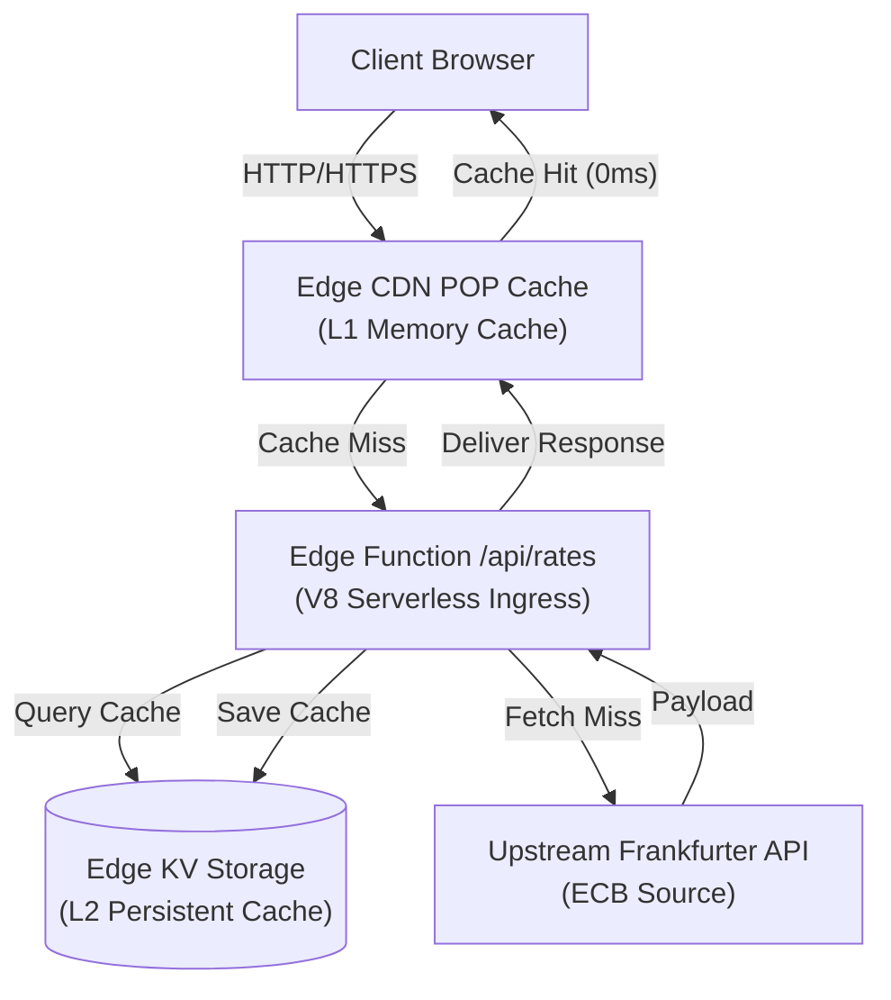
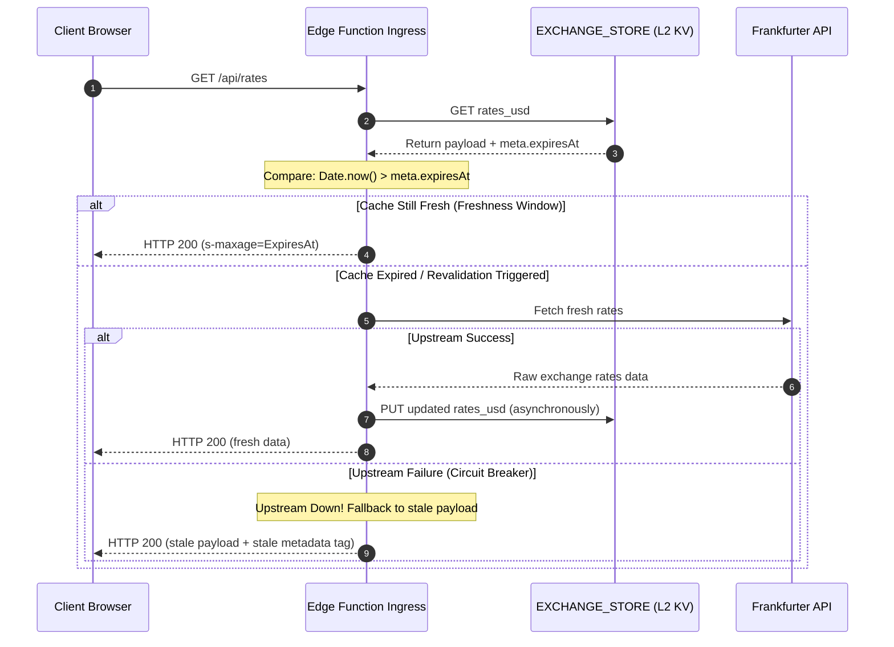

# Technical Architecture Manual

This document outlines the system architecture, data flow pipelines, and design decisions implemented in `rafifmsn/exchange`.

## 1. High-Level System Flow & Ingress

The application utilizes a decoupled architecture separating static assets from dynamic serverless API calls, maximizing edge performance and ensuring high resiliency.



### Decoupled Routing & Local Development Fallback
* **Production Ingress:** The static Astro pages are published to EdgeOne Pages. The serverless edge function is bound to `/api/rates`.
* **Local Development Isolation:** During local development (`astro dev`), the edge function backend is not executed by default. To preserve testing functionality:
  - The client script intercepts connection failures or `404` errors on `localhost`.
  - It dynamically falls back to query Frankfurter's public API directly and normalizes the payload. This allows for offline dropdown conversions and search filtering.

### Ingress Domain Validation
To protect the Edge Function from hotlinking and compute quota abuse, the ingress controller validates incoming request metadata (origins and referers) before parsing payloads:
* Supported origins include `localhost`, loopbacks, default `*.edgeone.app` hosts, and custom `*.mvc.my.id` subdomains.
* Requests violating allowed origins or referer checks are blocked at the edge with an HTTP `403 Forbidden` response.

## 2. Dual-Layer Caching Topology

To prevent hitting the upstream Frankfurter API's rate limits (which are in place to prevent server abuse/overload) and to maintain sub-millisecond execution times at the POP layer, the app implements a dual-layer caching strategy:

### Layer 1: Ephemeral POP Memory Cache (L1)
* **Strategy:** Edge caching headers are configured with `Cache-Control: public, s-maxage=86400, max-age=300`.
* **Behavior:** When the Edge Function returns a fresh payload, it is cached in the RAM of the local CDN Edge POP node. Subsequent user requests reaching that POP are served in **0ms** without triggering the Edge Function's V8 engine, costing zero monthly CPU execution resources.

### Layer 2: Persistent Globally-Replicated Edge KV (L2)
* **Strategy:** Rates are stored in Tencent EdgeOne Key-Value storage under the namespace bound to `EXCHANGE_STORE` (key: `rates_usd`).
* **Behavior:** If a request hits a cold CDN POP node (L1 Cache Miss), the Edge Function checks the global L2 Edge KV database. Since KV is globally replicated, this prevents hitting the upstream Frankfurter API.
* **Resiliency Fallback:** If the `EXCHANGE_STORE` KV namespace is not configured or bound in the cloud console, the edge function automatically bypasses KV operations, fetches from the upstream provider, and relies entirely on L1 POP caching.

## 3. Stateless Cache Revalidation & Circuit Breaker

The system employs a stateless, time-based cache revalidation strategy to bypass thundering herd issues without stateful mutex locks.



### 1. Stateless Expiration Check
Rather than querying key expiration states via KV database primitives, expiration is computed deterministically in the V8 engine:
* The payload includes a `meta` block containing `providerDate`, `updatedAt`, and `expiresAt` (24-hour TTL).
* If `Date.now() > meta.expiresAt`, the Edge Function triggers revalidation.

### 2. Circuit Breaker Fallback
If the upstream Frankfurter API is down or rate-limited:
* The Edge Function catches the error, marks the metadata attribute `meta.stale = true` and `meta.source = 'kv-hit'`, and returns the stale L2 cache payload.
* This is returned with a shortened CDN caching window (`Cache-Control: public, s-maxage=300`) to re-attempt fetching once the upstream recovers, avoiding service downtime.

## 4. Client-Side Hydration & Event Topology

To guarantee zero monthly quota leaks and fast UI transitions, state management is strictly decoupled from server interactions.

### 1. Single Ingress Fetch & Cache Detection
Upon page load, the client executes a single asynchronous fetch request to `/api/rates`. To dynamically resolve the cache source without stale payload biasing, the client inspects the response headers:
* If the `Age` header is greater than 0, or `X-Cache` is `HIT`, the client overrides the source metadata to `'cache-hit'`.
* Otherwise, it accepts the backend's honest `upstream-fetch` or `kv-hit` status.

Once resolved, the client caches the payload in browser RAM and broadcasts it via a custom window event:
```javascript
window.dispatchEvent(new CustomEvent('rates-updated', { detail: payload }));
```

### 2. Custom Element Event Listeners
The ported Starwind UI Custom Elements (`Select`, `Input`, `Table`) utilize global window events to synchronize states.
* **Component Listeners:** Components listen to `'rates-updated'` to populate lists and perform calculations.
* **Interactive Class-Based State Toggle:** To prevent input locking from the Starwind input controller's static `disabled` status, the elements are initialized as enabled but blocked visually using CSS classes (`pointer-events-none opacity-50`). These are removed via `classList.remove` once rates are cached in memory.
* **Select Syncing:** Dropping down and choosing a base currency dispatches a `'starwind:value-change'` event. The component reads `event.detail.value` directly to prevent synchronization race conditions, and recalculates the matrix instantly without hitting the network API.
